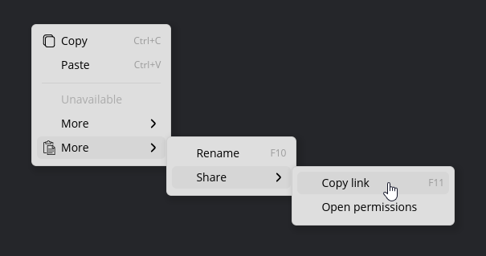

# iced_context_menu

Customizable context menus for [Iced](https://github.com/iced-rs/iced) **0.14**: right-click or programmatic open,
nested submenus, optional SVG row icons, hotkey hints, and theme-aware styling.



## Usage

Add to `Cargo.toml`:

```toml
iced_context_menu = { git = "https://github.com/Fee0/iced_context_menu.git" }
```

Wrap any widget and supply a `MenuSpec` (build with `.action`, `.disabled`, `.separator`, `.submenu`). Run
`cargo doc --open` for full API docs.

```rust
use iced::widget::text;
use iced_context_menu::{ContextMenu, ContextMenuStyle, MenuSpec};

fn view() -> iced::Element<'_, Message> {
    ContextMenu::new(text("Right-click me"))
        .items(
            MenuSpec::new()
                .action(1_u64, "Copy", None, Some("Ctrl+C".into()))
                .separator()
                .disabled(2_u64, "Unavailable", None, None),
        )
        .style(ContextMenuStyle::light())
        .on_select(|id| Message::MenuItem(id))
        .into()
}
```

Open behavior defaults to **right-click** on the wrapped region. For parent-controlled open, use
`ContextMenuOpen::Programmatic` with `ContextMenu::opens_with`.

## Theming

Use `ContextMenuStyle::from_theme` (or `ContextMenuStyle::dark` / `::light`) to follow the app `Theme`, or set fields on
`ContextMenuStyle` and pass `.style(…)`. The widget also has builder shortcuts for padding, row size, borders, shadow,
and more.

## Examples

```bash
cargo run --example right_click
cargo run --example two_region_hit_test
```
