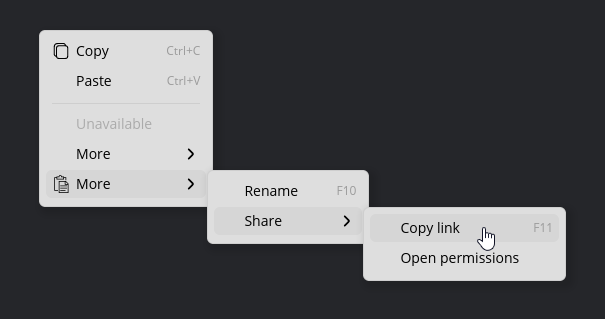

# iced_context_menu

Customizable context menus for [Iced](https://github.com/iced-rs/iced) **0.14**: right-click or programmatic open,
nested submenus, optional SVG row icons, hotkey hints, and theme-aware styling.



## Usage

Add to `Cargo.toml`:

```toml
iced_context_menu = { git = "https://github.com/Fee0/iced_context_menu.git" }
```

Wrap any widget and supply a `MenuSpec`. Build with `.action`, `.disabled`, `.toggle`, `.slider`,
`.separator`, `.submenu`.

A `.slider` row puts a value on a track of discrete stops — its label on one line, then the groove
with a dot on it at every stop, and under it a scale spelling out as many of them as fit, both ends
always, the current one in the row's label color. Each stop carries its own id, so click, drag and the arrow keys all report through
`.on_select` like any other row, once per stop crossed, and the menu stays open while the value is
dialled in.

```rust
use iced::widget::text;
use iced_context_menu::{ContextMenu, ContextMenuStyle, MenuSpec};

fn view() -> iced::Element<'_, Message> {
    ContextMenu::new(text("Right-click me"))
        .items(
            MenuSpec::new()
                .action(1_u64, "Copy", None, Some("Ctrl+C".into()))
                .separator()
                .disabled(2_u64, "Unavailable", None, None),
        )
        .style(ContextMenuStyle::from_theme)
        .on_select(|id| Message::MenuItem(id))
        .into()
}
```

Open behavior defaults to **right-click** on the wrapped region. Programmatic open also supported.

## Examples

Configure and test your context menu:

```bash
cargo run --example right_click
```
